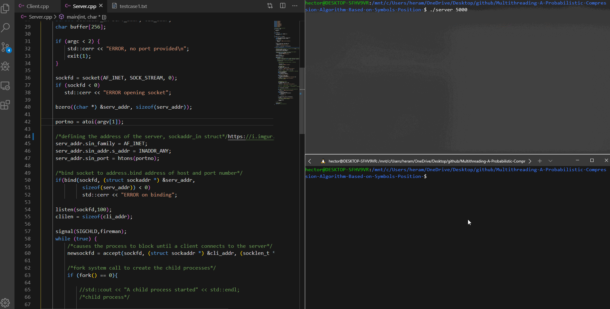

# Multithreading A Probabilistic Compression Algorithm Based on Symbols Position
### Based on the compression algorithm proposed by Rincon et al. in 2008 (A Probabilistic Compression Algorithm based on Symbols Position).
## The compression process

## AN EXAMPLE OF THE IMPLEMENTATION OF THE ALGORITHM



## The server program:

```
The user will execute this program using the following syntax:

./exec_filename port_no

where exec_filename is the name of your executable file, and port_no is the port number to create the socket.

This program receives requests from the child threads of the client program using sockets.
It will create a child process per request. For this reason, the parent process needs to handle 
zombies processes implementing the fireman() call in the primer. 
Each child process will generate the bit sequence of the requested symbol, 
returning the result to the client program using sockets.
```

## The client program:

```
The user will execute this program using the following syntax:

./exec_filename hostname port_no < input_filename

where exec_filename is the name of your executable file, hostname is the address where the server program is located, port_no is the port number used by the server program, and input_filename is the name of the file with the message to compress.

After calculating the frequency of each symbol in the message, your program must create a thread per each different symbol in the message. After the child threads finish processing the information, they will write the generated codes on a memory location available to the main thread. Finally, the main thread will print the information (step by step) about the compression process.
The child threads will execute the following tasks:

1. Send the message and the symbol to the server program using sockets. 

2. Wait for the generated code from the server program.

3. Write the received bit sequence into a memory location accessible by the main thread.

4. Finish its execution.

Input Format: Your program should read its input from stdin (C++ cin) and use input redirection. 
 
This input file will only have letters, numbers, and the EOL character (that will be represented as <EOL>). 
```

## A Closer Look 


```
The following example illustrates the compression
process described above.
Symbol size: 8 bits.
Message: ABCABCACBAAABCCCCBDF
Message size = 20
1) Frequency: A(6), B(5), C(7), D(1), F(1)
2) Sort by frequency: C(7), A(6), B(5), D(1), F(1)
3) Extract from queue: Symbol C
4) 20-bit word for symbol C:

A B C A B C A C B A A A B C C C C B D F
0 0 1 0 0 1 0 1 0 0 0 0 0 1 1 1 1 0 0 0

5) Delete symbol C from message:
New message: ABABABAAABBDF
Message size = 13
6) Queue not empty, go to step 3.
3) Extract from queue: Symbol A
4) 13-bit word for symbol A:
A B A B A B A A A B B D F
1 0 1 0 1 0 1 1 1 0 0 0 0


5) Delete symbol A from message:
New message: BBBBBDF
Message size = 7
6) Queue not empty: go to step 3.
3) Extract from queue: Symbol B
4) 7-bit word for symbol B:
B B B B B D F
1 1 1 1 0 0

5) Delete symbol B from message:
New message: DF
Message size = 2
6) Queue not empty: go to step 3.
3) Extract from queue: Symbol D
4) 2-bit word for symbol D:
D F
1 0

5) Delete symbol D from message:
New message: F
Message size = 1
6) Queue not empty: go to step 3.
3) Extract from queue: Symbol F
4) 1-bit word for symbol F:
F
1

5) Delete symbol F from message:
New message: empty
Message size = 0
6) Queue empty: go on to step 7


7) Concatenate the bit words generated:
0010010100000111100010101011100001111100101
Compressed message size = 43 bits.


The resulting compressed representation of the
original message is the concatenation of all the symbols associated bit words in the order in which they were
generated:
C= 20; A=13; B=7; D=2; F=1 

C 00100101000001111000
A 1010101110000 
B 1111100
D 10
F 1
``` 
